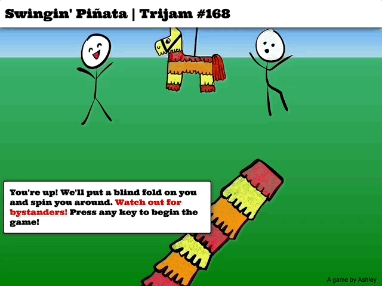
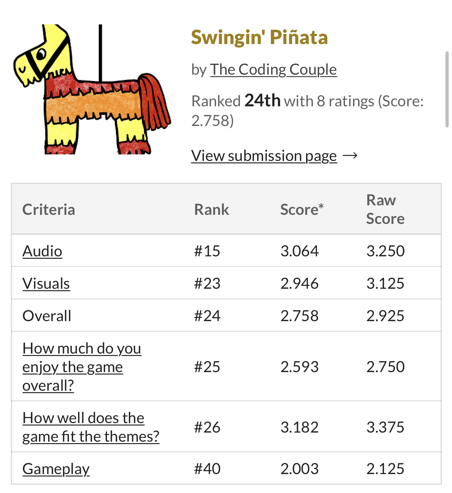

# trijam-168
Source code for [Ashley's Trijam #168 entry](https://thecodingcouple.itch.io/swingin-pinata).  The theme is "Don't hurt nobody."

[Trijam](https://itch.io/jam/trijam-168) is a weekly game jam where the goal is to create a game in under 3 hours of development time. Didn't quite make the 3 hour deadline, fortunately, the game jam allows for overtime.  

Total Dev + Asset Creation Time: ~5 hours.

## Synopsis

Swingin' Pi&#0241;ata is a reaction style game. Players are up for their turn to swing at a pi&#0241;ata. 

The first key press determines the angle at which the player has been rotated during the spin phase.

The second key press determins the correction angle to reorient the player in front of the pi&#0241;ata. 

Watch out for bystanders! If the player is unable to reorient within a small margin of error, they'll miss the pi&#0241;ata and hit a bystander, losing the game. 



Swingin Pinata [ranked number 24 out of 45 entries](https://itch.io/jam/trijam-168/results).



## Built With

* Vanilla JS
* Visual Studio Code

## Third Party Assets

* [Ultra Google Font](https://fonts.google.com/specimen/Ultra)
* Mega FX Pack (Catapult_launch_5.wav)
* Cute Game Sounds (Cute_Game_Musical_SFX_Orchestral_Cute_Accomplishment_01.wav)
* Thinkroot Records - 8-bit Brave Adventure (Kara Square - 8-Bit Side-Scrolling Action.wav)

## Useful Resources

* [Two animations on same element not working](https://stackoverflow.com/questions/20584954/two-animations-on-same-element-not-working) (Can't animate same property twice :facepalm:)
* [How to get value of transform in JavaScript](https://stackoverflow.com/a/42267490)
* [Get value of CSS rotation through JavaScript](https://css-tricks.com/get-value-of-css-rotation-through-javascript/)

## Ideas for future improvements

* Provide better feedback for the users. Specifially in the second play state, it would be nice to have some visual indicator of how far off the player's orientation was before trying to correct it.
* Improved scaling on different widths and heights

## Project Setup

Run with local web server

```bash
python -m http.server 8000
```

or

```bash
python3 -m http.server 8000
```

## Maintainers

* [Ashley Grenon - @townsean](https://github.com/townsean)

## License (MIT)

MIT License

Copyright (c) 2022 Ashley Grenon

Permission is hereby granted, free of charge, to any person obtaining a copy of this software and associated documentation files (the "Software"), to deal in the Software without restriction, including without limitation the rights to use, copy, modify, merge, publish, distribute, sublicense, and/or sell copies of the Software, and to permit persons to whom the Software is furnished to do so, subject to the following conditions:

The above copyright notice and this permission notice shall be included in all copies or substantial portions of the Software.

THE SOFTWARE IS PROVIDED "AS IS", WITHOUT WARRANTY OF ANY KIND, EXPRESS OR IMPLIED, INCLUDING BUT NOT LIMITED TO THE WARRANTIES OF MERCHANTABILITY, FITNESS FOR A PARTICULAR PURPOSE AND NONINFRINGEMENT. IN NO EVENT SHALL THE AUTHORS OR COPYRIGHT HOLDERS BE LIABLE FOR ANY CLAIM, DAMAGES OR OTHER LIABILITY, WHETHER IN AN ACTION OF CONTRACT, TORT OR OTHERWISE, ARISING FROM, OUT OF OR IN CONNECTION WITH THE SOFTWARE OR THE USE OR OTHER DEALINGS IN THE SOFTWARE.
